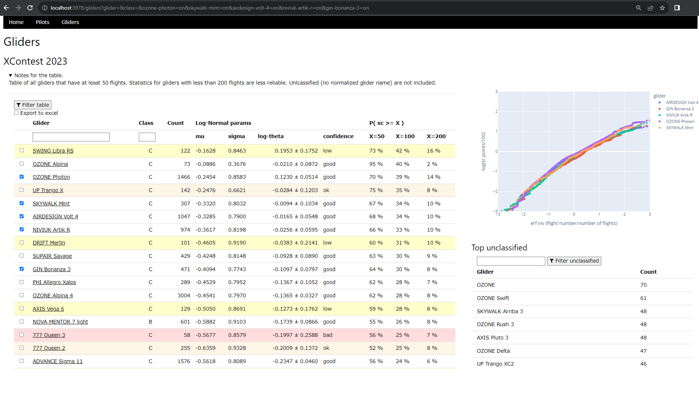

# paraglider-stats
Tool to download paraglider flights (eg from xcontest) and evaluate them

## Setup

### Initial setup

0. Check out the project
1. Set up env file: Make a copy of `template.env` and rename to `.env`
2. Install requirements: In a terminal run `python -m pip install -r requirements.txt`
3. Start app: In a terminal run `python app.py`
4. Navigate to the app [http://localhost:3978](http://localhost:3978)
5. Go to the `pilots`, get data

## Data 

Flights scraped from [xcontest 2023 PG sport ranking](https://www.xcontest.org/2023/world/en/ranking-pg-sport/).
Out of the ~24K pilots there, roughly the first 15k (therefore ca 90k flights) are taken into account. In the sport class at around rank 15000 the pilots have approximately 10 XC-points per flight.

## Theory

Statement: The XC-points for a given glider type follow [log-normal](https://en.wikipedia.org/wiki/Log-normal_distribution)

This means that once the parameters `mu` and `sigma` are estimated, we can compute the probability of achieving a given number of XC-points with the given glider the following way.

If we treat `X`, the XC-points gained at a given flight, as a log-normal random variable, then its (natural) logarithm is a normally distributed random variable with mean `mu` and variance `sigma` squared. Therefore, the probability that `X` is larger than a prefixed value `x`, e.g. 100 points, is the following:

$$ P(X >= x) = 1 - P(X < x) = 1 - \Phi(\frac{\ln x - \mu}{\sigma}) $$

Furthermore, based on the sample estimates of the logarithmic variable `Y = log X`, we can have an estimation for e.g. 95% confidence interval for the sample mean of `X`:

$$ \ln \theta = \ln \rm{E} X = \bar Y + S^2/2 \pm z \sqrt{\frac{S^2}{n} + \frac{S^4}{2(n-1)}  } $$

with $$ z = 1.96 $$.

As we will see, for many wings `S^2 approx 0.8^2`. For small sample sizes `n` approx 50 (meaning only around 10 different pilots), the inaccuracy of the log of the mean is therefore approximately 0.22. To be able to reasonably distinguish the performance of 2 different gliders, these confidence intervals should have a small overlap. For an order of difference of $$ \Delta \ln \theta \approx 0.1 $$ we need at least `n` approx 200 flights.

## Results

This year has been quite exciting since a bunch of new EN-C 2-liners appeared on the market.

### Overview

### Gliders

### Glider details

