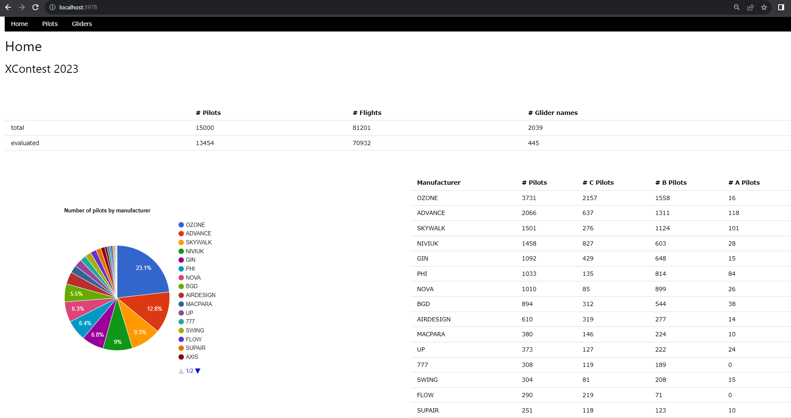

# paraglider-stats
Tool to download paraglider flights (eg from xcontest) and evaluate them

## Setup

### Initial setup

0. Check out the project
1. Set up env file: Make a copy of `template.env` and rename to `.env`
2. Install requirements: In a terminal run `python -m pip install -r requirements.txt`
3. Start app: In a terminal run `python app.py`
4. Navigate to the app [http://localhost:3978](http://localhost:3978)
5. Go to the `pilots`, get data

## Data 

Flights scraped from [xcontest 2023 PG sport ranking](https://www.xcontest.org/2023/world/en/ranking-pg-sport/).
Out of the ~24K pilots there, roughly the first 10k (therefore ca 60k flights) are taken into account.

## Theory

Statement: The XC points for a given glider type follow [log-normal](https://en.wikipedia.org/wiki/Log-normal_distribution)

This means that once the parameters `mu` and `sigma` are estimated, we can compute the probability of achieving a given number of XC points with the given glider.

## Results

This year has been quite exciting since a bunch of new EN-C 2-liners appeared on the market.

### Overview

### Gliders

### Glider details

